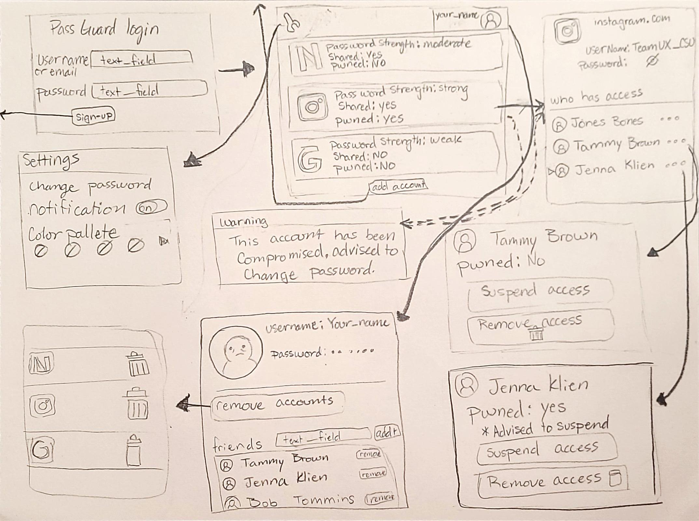
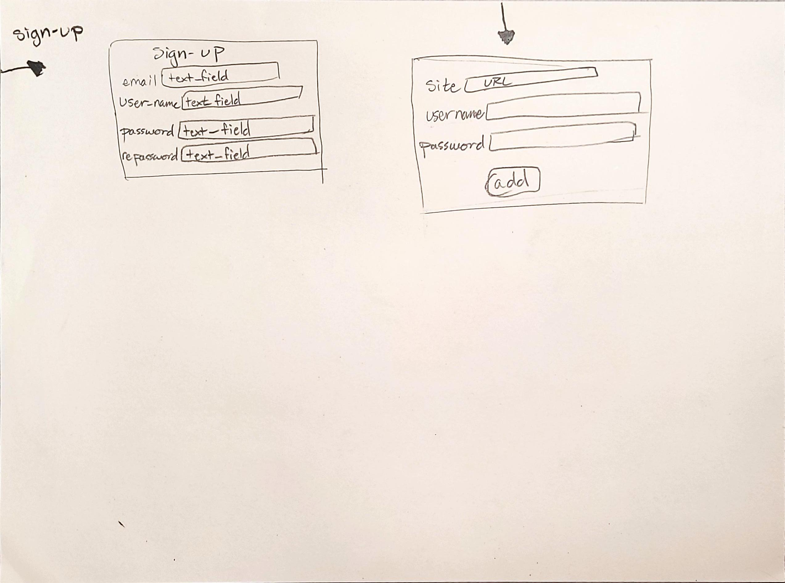

# Sketches

In our first sketch we start at the basic PassGuard Login page, of the user has not created a profile, they can click the sign-up button to be directed to a sign-up page. After logging in, the user will be shown each password stored in their account, along with the password strength, if the password is being shared, and if the password has been compromised. By clicking on the app we can see the username, and the password, along with who else has access to the password. The user can click on the names of the shared access to check if the user has been compromised, or to edit the access of the user on the app. If a shared user whose passwords have been compromised, the current user will be informed that a shared user has been compromised. The user can also look at the information of their account by clicking their profile imaage. There you can see the username, password, and friends, along with editing which passwords are shown in the home page.

Basic Sign-up page, and adding a new app account.

!!!Give context by explaining each sketch image!!!
