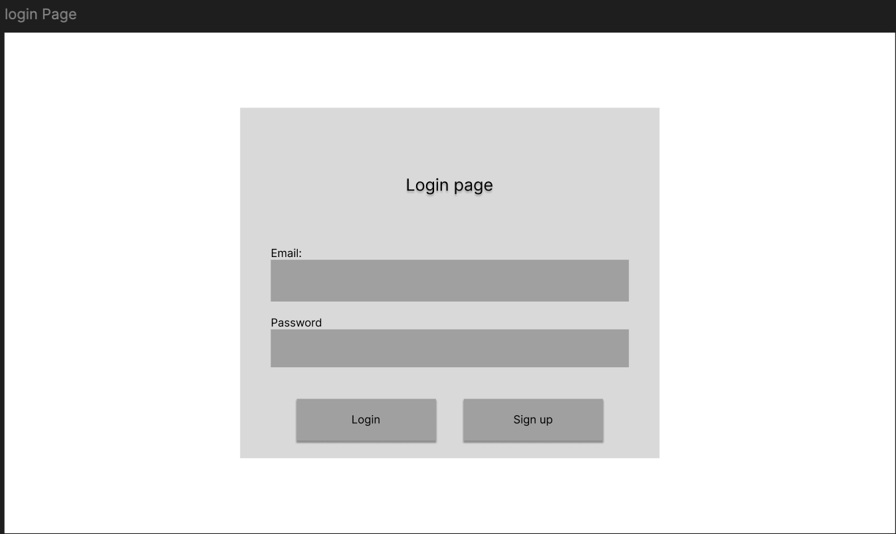
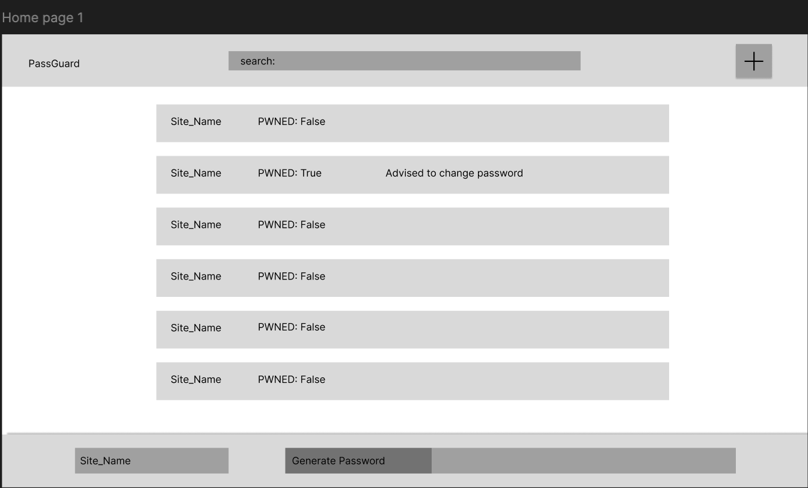
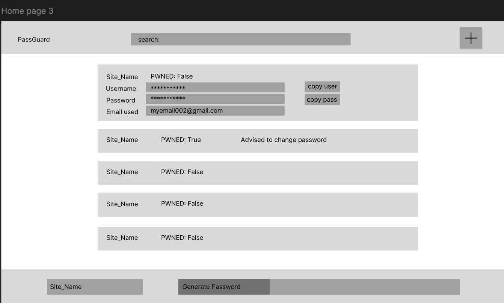
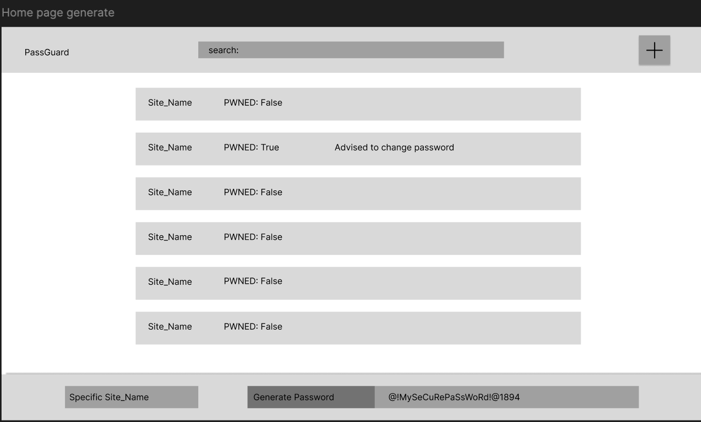

# Wireframes

### Sign-Up Page

*Allows a new user to create an account by entering their credentials.

---

### Login Page

*Existing users enter their credentials to access their passwords

---

### Home Page - View 1

*Overview of the main dashboard upon logging in.

---

### Home Page - View 2

*Expanded view showing stored credentials.

---

### Home Page - View 3

*Expanded view showing more hidden credentials

---

### Generate Password Page

*Form used to create a new credential.
